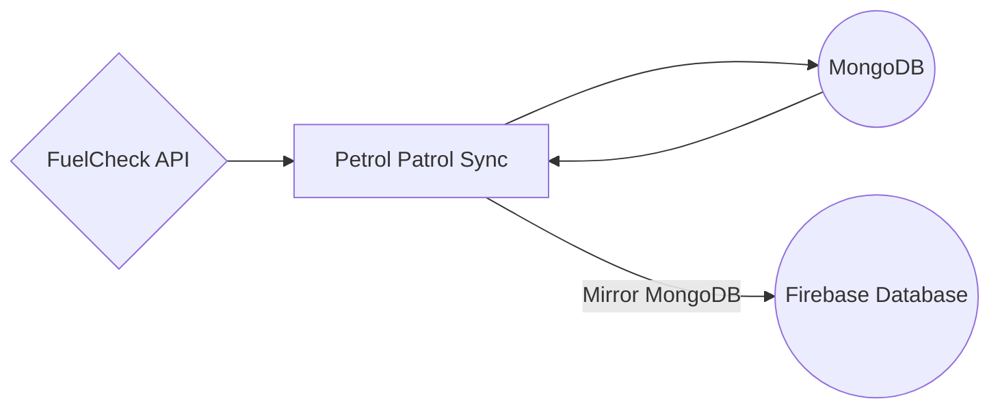

# Petrol Patrol Sync
A synchronisation script intended to routinely update the Petrol Patrol Firebase database with changes from the FuelCheck API.

## Getting Started
The script requires three sets of credentials in order to function correctly.

 - The FuelCheck API
 - A MongoDB database
 - Firebase Realtime Database

The corresponding credentials need to be inserted into the code at the following paths:

 - /api/fuelcheck/fuelcheck-credentials.json
 - /api/mongodb/mongodb-credentials.json
 - /api/firebase/firebase-credentials.json

To execute the sync script:

```
node index.js
```

## Deployment
As this is intended to be run as a scheduled job, the ideal deployment location would be a 3rd party server such as Heroku.

## Design

There are three main components to the synchronisation of the FuelCheck data:

 - The FuelCheck API as the source of information
 - A MongoDB as an intermediary datastore to perform operations on
 - The Firebase Realtime Database as the final datastore for API calls



### Rationale
The rationale for this relatively complicated design is purely based on minimising costs to access these services.

The FuelCheck API has a limit on the number of calls that can be made and so a new endpoint must be made to overcome this API limit.

Given that the API is used only in a read-only manner, a self-managed copy of FuelCheck's data will allow clients to access the data without directly hitting their API and racking up hit counts.

The Firebase Database is the new endpoint for clients to access as this has no set limit on the number of API calls, but rather a total bandwidth limit instead.

The MongoDB intermediary database is introduced to minimise the bandwidth usage on Firebase. Given that the synchronisation script reads the entire active database each time, the bandwidth quota would mainly come from the sync script instead of client usage.

All operations will first be applied to the intermediary database, taking all of the read-write costs, and only when the sync has been finalised, do we mirror the changes onto Firebase.

